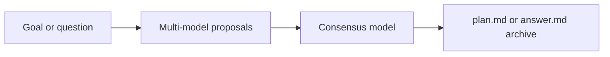

# planner-ai (Python)

Terminal UI that asks several models for a plan or answer in parallel, reconciles via a consensus model, and either writes `plan.md` (Plan mode) or returns a Q&A answer (Ask mode). It plans and answers; it does not execute.

This package is the Python/Textual port. The TypeScript app at the repo root remains available until you cut over fully.

## Requirements

- Python ≥ 3.14
- [uv](https://docs.astral.sh/uv/)

## Install and run

### From this directory (development)

```bash
cd planner-ai
uv sync
uv run planner
```

Or:

```bash
uv run python -m planner_ai
```

### Install as a tool (any project)

From PyPI:

```bash
uv tool install planner-ai
# or: pip install planner-ai
```

From this package directory (development):

```bash
uv tool install .
```

Then from any project you want to plan:

```bash
cd ~/code/my-app
planner
```

Both the Bun and Python CLIs expose the same console name `planner`. If both are on your `PATH`, whichever comes first wins. Prefer one install at a time, or call the Python app explicitly with `uv run --directory /path/to/planner-ai planner`.

## Auth / tokens

On first run the TUI opens **Auth** when no real credential is set (set at least one real provider; empty Enter cancels a token editor):

- **Claude Code OAuth token** — run `claude setup-token`, then paste (Team / Pro / Max subscription)
- **Cursor API key** — from [Cursor Dashboard → Integrations](https://cursor.com/dashboard/integrations)
- **Codex API key** — from [OpenAI API keys](https://platform.openai.com/api-keys)

Tokens are saved under the OS user config directory (same path and JSON shape as the TypeScript app):

- macOS: `~/Library/Application Support/planner-ai/config.json`
- Linux: `~/.config/planner-ai/config.json` (or `$XDG_CONFIG_HOME/planner-ai`)
- Windows: `%APPDATA%\planner-ai\config.json`

Never commit tokens or put them in `.env`. The app does not log credential values.

Providers without a key are omitted; if none are set, mock providers are used. With real keys present, mocks appear only when `includeMocks` is enabled (press `m` on Proposers/Consensus).

If a stored key fails auth during a run, the error screen offers **`r`** to remove that key from config and re-enter it (or **`q`** to quit). To clear all credentials without launching the TUI:

```bash
uv run planner --reset-auth
# or, if installed as a tool:
planner --reset-auth
```

## What it does

- Plans/asks against the folder you launched the CLI in (`cwd`)
- Asks several models in parallel (one failure does not cancel the others)
- Uses a separate consensus model to reconcile
- **Plan mode:** writes `plan.md` in that folder (backs up an existing file as `plan.md.bak`) and archives the run
- **Ask mode:** same multi-proposer + consensus flow with Q&A prompts; does **not** write cwd `plan.md`; archives under `.planner-ai/ask-…/`

## TUI

Fullscreen alternate-screen UI with tabs:

| Tab | Shortcut | What it does |
| --- | --- | --- |
| **Plan** | `Ctrl+1` | Plan/Ask toggle, enter a goal or question, watch proposals / consensus, browse the result |
| **Proposers** | `Ctrl+2` | Pick proposer models (multi) — Claude / Cursor / Codex / Mock |
| **Consensus** | `Ctrl+3` | Pick the consensus model (single) |
| **Auth** | `Ctrl+4` | Set or clear Claude OAuth / Cursor / Codex API keys |
| **History** | `Ctrl+5` | Browse past successful runs archived under `.planner-ai/` |

You can also click the tab labels. On Models: click a row or use `↑↓` / `PgUp`/`PgDn`, `Space` toggle/choose, `/` filter, `m` toggle mocks, `c` continues to Plan.

Startup opens **Auth** if no real credential is set, else **Proposers** if there is no saved selection, else **Plan**.

## How it works

1. You provide a goal (Plan) or question (Ask) on the Plan tab.
2. Models inspect the current working directory (read-only) and each propose.
3. A consensus model reconciles the proposals into one plan or answer.
4. Plan mode writes `plan.md`; both modes archive under `.planner-ai/`.



## Output

`plan.md` (Plan mode) is the artifact meant for a later execution step. This tool produces the plan; it does not run it.

Each successful run is archived under `.planner-ai/`:

```
.planner-ai/
  plan-2026-08-13T16-48-00/
    anthropic-claude-sonnet-4-5-output.md
    plan.md
  ask-2026-08-13T16-49-00/
    cursor-composer-2.5-output.md
    answer.md
```

- Plan runs: `plan-{YYYY-MM-DDTHH-MM-SS}/` with per-model `*-output.md` and consensus `plan.md`
- Ask runs: `ask-{YYYY-MM-DDTHH-MM-SS}/` with per-model `*-output.md` and consensus `answer.md`
- Collision dirs: `plan-{ts}-2`, `plan-{ts}-3`, …
- History lists both kinds newest-first (by timestamp, not full dirname)

Archives written by the TypeScript app remain readable.

## Development

```bash
cd planner-ai
uv sync
uv run planner              # TUI (plans cwd)
uv run planner --reset-auth
uv run pytest
uv run ruff check src tests
```

Plan another folder without installing:

```bash
cd ~/code/my-app
uv run --directory /path/to/planner-ai/planner-ai planner
```
