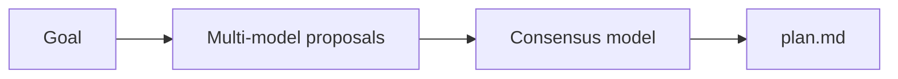

# planner-ai

A terminal UI that turns a goal into a consensus plan across multiple models.

## What it does

- Plans against the folder you launched the CLI in
- Asks several models for a plan in parallel
- Uses a separate consensus model to reconcile disagreements
- Writes a single `plan.md` in that folder, ready to execute later

## Setup

Requires [Bun](https://bun.sh) ≥ 1.2.

```bash
bun install
```

On first run the TUI asks for tokens only when they are missing from your local config (Enter skips a provider):

- **Claude Code OAuth token** — run `claude setup-token`, then paste (Team / Pro / Max subscription)
- **Cursor API key** — from [Cursor Dashboard → Integrations](https://cursor.com/dashboard/integrations)

Tokens are saved under the OS user config directory:

- macOS: `~/Library/Application Support/planner-ai/config.json`
- Linux: `~/.config/planner-ai/config.json` (or `$XDG_CONFIG_HOME/planner-ai`)
- Windows: `%APPDATA%\planner-ai\config.json`

Skipped providers are omitted; if both are skipped, mock providers are used.

If a stored key fails auth during a run, the error screen offers **`r`** to remove that key from config and re-enter it (or **`q`** to quit). To clear both credentials without running the TUI:

```bash
bun start -- --reset-auth
# or: bun run dev -- --reset-auth
```

## Run

The CLI plans against the folder you launch it from (same rule as Claude Code). `cd` into the project first:

```bash
cd ~/code/my-app
bun --cwd /path/to/planner-ai run src/cli.tsx
```

Or from this repo (plans *this* repo):

```bash
bun run dev
```

With the `planner-ai` bin linked (same Bun shebang):

```bash
bun link
cd ~/code/my-app
planner-ai
```

## TUI

Fullscreen alternate-screen UI with three tabs:

| Tab | Shortcut | What it does |
| --- | --- | --- |
| **Plan** | `Ctrl+1` | Enter a goal, watch proposals / consensus, see `plan.md` |
| **Models** | `Ctrl+2` | Pick proposers (multi) and consensus (single) — click or keyboard |
| **Auth** | `Ctrl+3` | Set or clear Claude OAuth / Cursor API key |

You can also click the tab labels. On Models: click a row or use `↑↓` / `PgUp`/`PgDn`, `Space` toggle/choose, `Tab` switches proposers ↔ consensus ↔ Continue, `c` continues to Plan.

Startup opens **Auth** if either credential is missing, else **Models** if there is no saved selection, else **Plan**.

## How it works

1. You provide a goal (Plan tab).
2. Models inspect the current working directory (read-only) and each propose a plan.
3. A consensus model reconciles the proposals into one plan.
4. The result is written to `plan.md` in that same directory.



## Output

`plan.md` is the artifact meant for a later execution step. This tool produces the plan; it does not run it.
